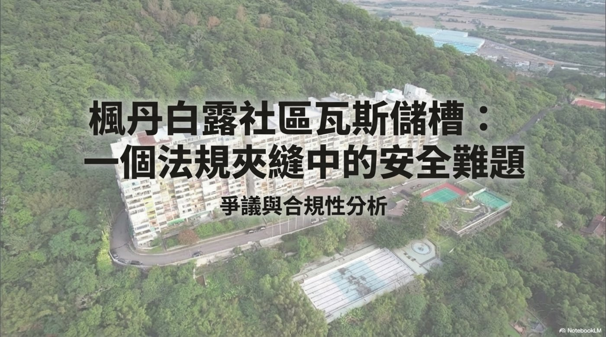
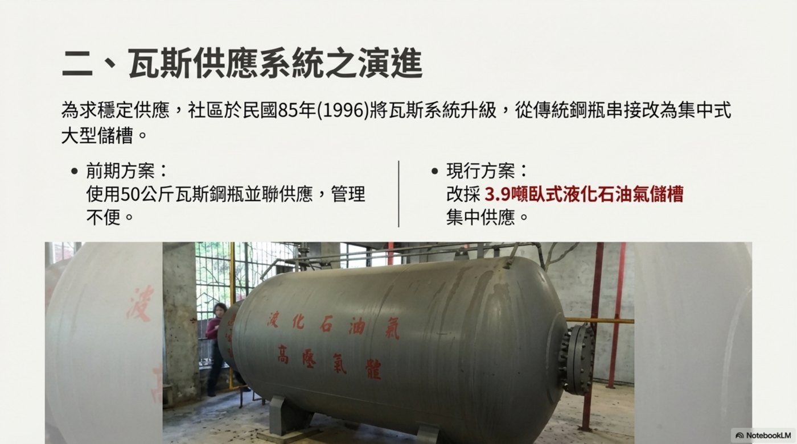
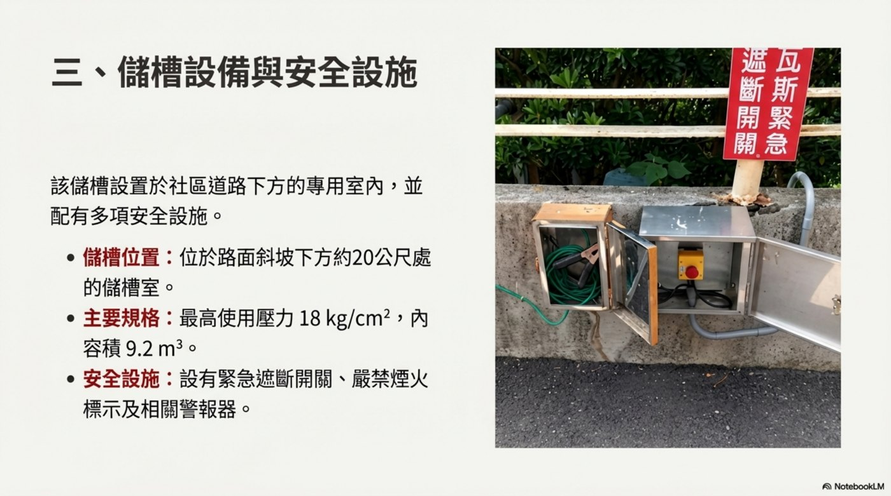
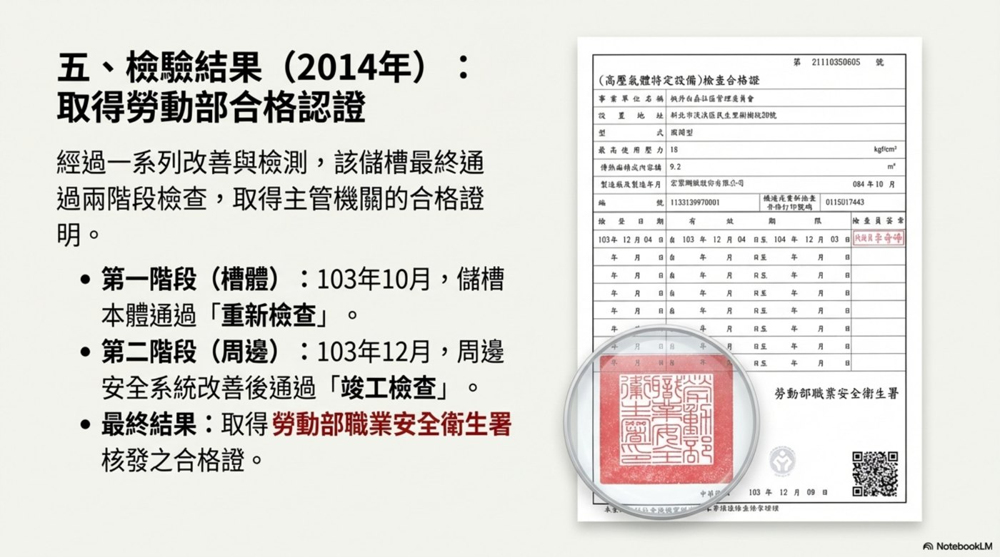
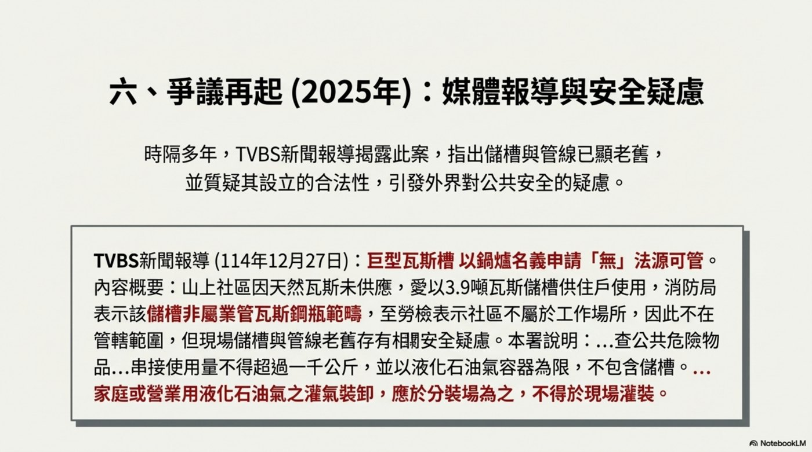
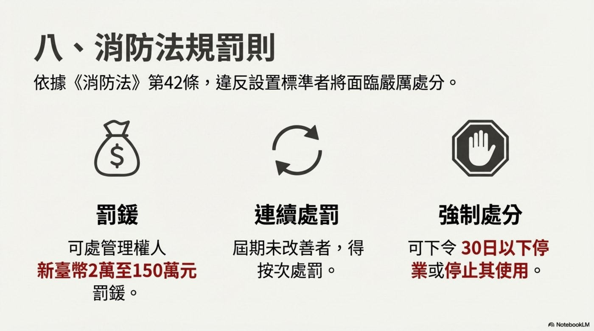
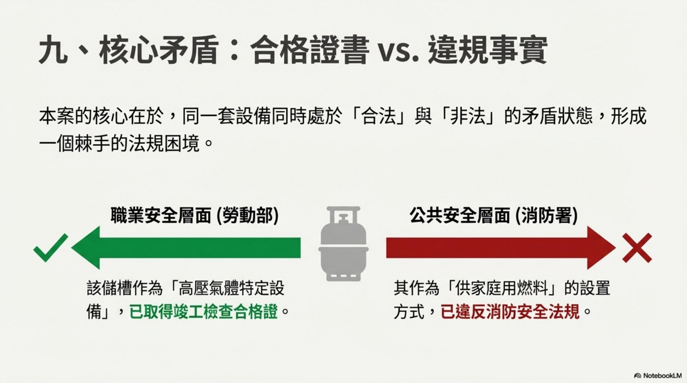

# 個案導入：法規夾縫中的瓦斯儲槽
> 楓丹白露社區瓦斯儲槽個案呈現一個典型公共安全難題：設備曾取得檢驗合格證明，但其設置方式仍被消防機關認定違反消防法規。

[image-text position="right" width="48"]

這份公安會議資料以「爭議與合規性分析」為主軸，討論山區大型集合住宅在天然氣管線未達前，長期使用替代燃料供應方式所衍生的安全與法規問題。

- 案件焦點不是單純設備有無檢驗
- 核心在於使用場域、供應方式與消防法規之間的落差
- 風險判斷必須同時看技術安全與公共安全
[/image-text]

## 社區基本資料

### 🏘️ 社區概況
- 社區名稱：楓丹白露社區
- 地理位置：新北市淡水區樹梅坑，鄰近北投、關渡
- 社區規模：315 戶，地上 12 層、地下 3 層
- 使用執照：民國 72 年核發
- 社區因天然氣管線未達，長期仰賴替代燃料供應方式

### 🧭 案件定位
- 屬於山區大型集合式住宅的燃料供應安全議題
- 涉及社區住戶日常能源需求
- 涉及高壓氣體特定設備管理
- 同時觸及消防安全法規對液化石油氣供應方式的限制

---

# 供應系統演進：從鋼瓶串接到大型儲槽
> 社區為求穩定供應，在民國 85 年將瓦斯系統升級，由傳統鋼瓶串接改為集中式大型儲槽。

## 瓦斯供應方式變化

### 🔁 前期與現行方案
[image-text position="left" width="46"]

- 前期方案：使用 50 公斤瓦斯鋼瓶並聯供應，管理不便
- 現行方案：改採 3.9 噸臥式液化石油氣儲槽集中供應
- 變更目的：提高供應穩定度，降低頻繁更換鋼瓶的管理負擔
[/image-text]

### ⚙️ 儲槽設備與安全設施
[image-text position="right" width="44"]

- 儲槽位於社區道路下方的專用室內
- 儲槽位置約在路面斜坡下方 20 公尺處
- 主要規格：最高使用壓力 18 kg/cm2，內容積 9.2 m3
- 安全設施：緊急遮斷開關、嚴禁煙火標示與相關警報器
[/image-text]

> **設備安全不等於設置合規**
> 儲槽有安全設施，並不代表其設置方式必然符合所有法規。公共安全審查必須同時檢視設備規格、使用場域、供應量、灌裝方式與主管法規。

---

# 檢驗歷程：從納管申請到取得合格證明
> 民國 103 年因法規變革，社區管委會主動申請將儲槽納入安全管理體系，並經改善與檢測後取得主管機關合格證明。

## 2014 年納管與檢驗

### 🧾 納管申請過程
- 法規轉變：職業安全衛生法於 103 年 7 月擴大適用範圍
- 該儲槽正式被歸類為「危險性設備」
- 社區主動申請納入安全管理體系
- 年初因不適用舊法《勞工安全衛生法》，曾遭代檢機構「中華鍋爐協會」退回
- 新法生效後，代檢機構要求社區依法申請檢驗

### ✅ 檢驗結果
[image-text position="right" width="44"]

經過一系列改善與檢測後，該儲槽最終通過兩階段檢查：

- 第一階段：103 年 10 月，儲槽本體通過「重新檢查」
- 第二階段：103 年 12 月，周邊安全系統改善後通過「竣工檢查」
- 最終結果：取得勞動部職業安全衛生署核發之合格證
[/image-text]

### 🧩 合格證明的意義
- 在職業安全層面，儲槽被視為高壓氣體特定設備
- 合格證明代表設備本體與部分安全系統曾通過檢查
- 但合格證明不必然處理「住宅社區是否可如此設置供應」的消防安全問題

---

# 爭議再起：媒體報導與消防安全疑慮
> 2025 年媒體重新揭露本案，指出儲槽與管線老舊，並質疑其設立合法性，引發外界對公共安全的疑慮。

## 2025 年事件焦點

### 📰 媒體報導重點
[image-text position="left" width="48"]

- TVBS 於 114 年 12 月 27 日報導此案
- 報導指出山上社區因天然瓦斯未供應，使用 3.9 噸瓦斯儲槽供住戶使用
- 消防局表示該儲槽非屬業管瓦斯鋼瓶範疇
- 勞檢觀點認為社區不屬於工作場所，因此不在管轄範圍
- 現場儲槽與管線老舊，仍存在公共安全疑慮
[/image-text]

### 🔎 爭議本質
- 儲槽作為高壓氣體特定設備，曾取得竣工檢查合格證
- 儲槽作為住宅社區供家庭用燃料的設置方式，被消防機關認定違反消防安全法規
- 同一設備在不同法規體系下產生不同判斷
- 形成權責交界與公共安全治理難題

## 消防署認定

### 🚫 違反消防法規的理由
- 不論該設備是否通過勞動部檢驗，其設置方式已被認定違反現行消防法規
- 違反容量限制：依管理辦法第 73-1 條，家庭用串接量不得逾 1000 公斤，且法規明確排除儲槽
- 違反灌裝程序：依管理辦法第 77 條，液化石油氣應於分裝場灌裝，不得於使用現場灌裝

### ⚖️ 消防法規罰則
[image-text position="right" width="42"]

依據消防法第 42 條，違反設置標準者可能面臨：

- 罰鍰：可處管理權人新臺幣 2 萬至 150 萬元罰鍰
- 連續處罰：屆期未改善者，得按次處罰
- 強制處分：可下令 30 日以下停業或停止其使用
[/image-text]

---

# 核心矛盾：合格證書 vs. 違規事實
> 本案核心在於同一套設備同時處於「合法」與「非法」的矛盾狀態，形成棘手的法規困境。

## 兩個主管邏輯

### ✅ 職業安全層面
- 該儲槽作為「高壓氣體特定設備」
- 已取得竣工檢查合格證
- 判斷重點偏向設備本體、壓力、檢查與安全系統是否合格

### ❌ 公共安全層面
- 該儲槽作為「供家庭用燃料」的設置方式
- 已違反消防安全法規
- 判斷重點偏向住宅場域、供應量、使用現場灌裝與公共危險物品管理

### ⚠️ 法規競合下的漏洞
[image-text position="left" width="48"]

本案呈現跨部會法規競合下的公共安全漏洞：

- 技術檢查合格，不代表設置場域合規
- 設備安全證明，不能取代消防法規判斷
- 住宅社區的集體風險，需要以公共安全角度重新檢視
[/image-text]

---

# 後續處理：從個案查處到類案清查
> 簡報結論指出，這座 3.9 噸瓦斯儲槽凸顯跨部會法規競合下的公共安全漏洞，後續重點是依法查處並清查是否存在類似案例。

## 行動方向

### 🧭 後續行動
- 消防署已函請新北市消防局依法查處
- 將清查全國是否存在類似案例
- 目標是維護公共安全，避免相同法規落差在其他社區重演

### 🧠 個案學習重點
[flow]
1. 先釐清場域 — 是工作場所、住宅社區，還是公共危險物品管理場景
2. 再拆分設備角色 — 是高壓氣體特定設備，還是家庭用燃料供應設備
3. 檢查證明邊界 — 合格證書只代表特定法規下的檢驗結果
4. 回到公共安全 — 當使用情境牽涉大量住戶，消防風險必須被獨立評估
5. 建立類案清查 — 個案處理後，要回推制度是否有相同漏洞
[/flow]

### 📌 會議討論提示
- 現有法規對山區集合住宅替代燃料供應是否足夠清楚？
- 當不同主管機關認定不同時，誰負責做最終公共安全風險判斷？
- 已取得技術檢驗合格的設備，若設置方式違反消防法規，改善路徑應如何設計？
- 類似社區是否需要建立專案清查與過渡改善機制？

---

# 總結

[summary]
- 🏘️ **社區背景** | 楓丹白露位於淡水山區，315 戶集合住宅因天然氣未達而長期使用替代燃料
- ⚙️ **設備演進** | 民國 85 年由鋼瓶串接改為 3.9 噸臥式液化石油氣儲槽集中供應
- ✅ **檢驗歷程** | 民國 103 年納管後，儲槽本體與周邊安全系統通過檢查並取得合格證
- 🚫 **消防爭議** | 消防機關認定其容量與現場灌裝方式違反消防法規
- ⚖️ **核心矛盾** | 職安合格不等於消防合規，本案凸顯跨部會法規競合下的公共安全漏洞
- 🔎 **後續行動** | 依法查處、清查類案，並重新檢視山區社區替代燃料供應的風險治理
[/summary]
